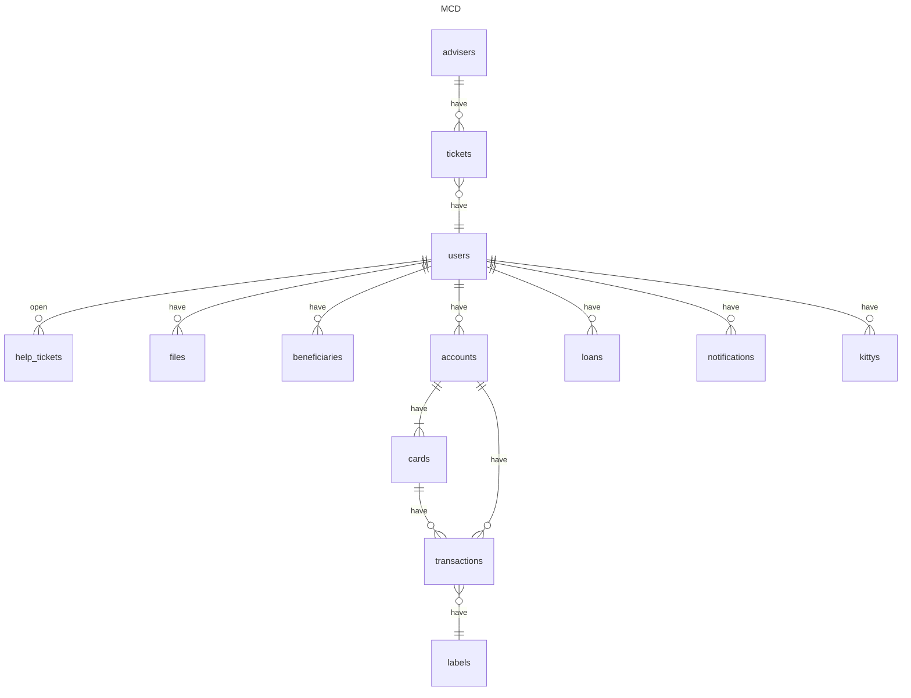
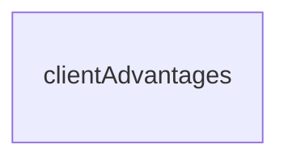

```mermaid
---
    title : MCD
---
erDiagram
    advisers
    tickets
    users
    help_tickets
    files
    beneficiaries
    accounts
    cards
    transactions
    labels
    loans
    notifications
    kittys
    
    advisers ||--o{ tickets : have
    tickets }o--|| users : have

    users ||--o{ help_tickets : open
    users ||--o{ files : have
    users ||--o{ beneficiaries : have
    users ||--o{ accounts : have
    users ||--o{ loans : have
    users ||--o{ notifications : have
    users ||--o{ kittys : have

    accounts ||--|{ cards : have
    cards ||--o{ transactions : have
    accounts ||--o{ transactions : have

    transactions }o--|| labels : have
```

```mermaid
erDiagram
    clientAdvantages
```