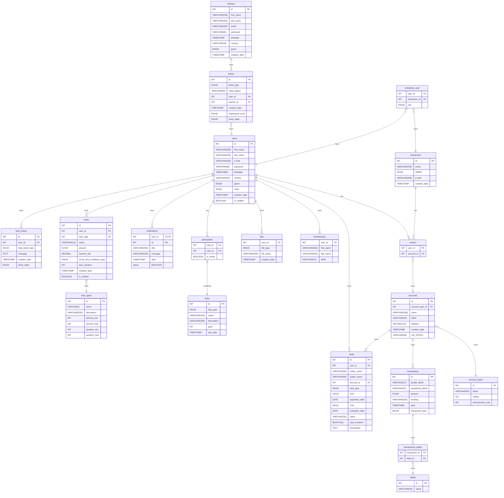
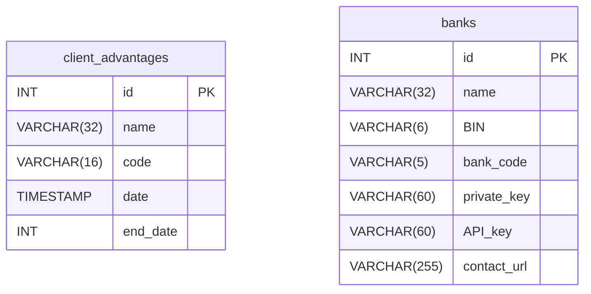

```mermaid
erDiagram
    advisers {
        INT id PK
        VARCHAR(255) first_name
        VARCHAR(255) last_name
        VARCHAR(320) email
        VARCHAR(60) password
        TIMESTAMP birthdate
        VARCHAR(32)  country
        ENUM  genre 
        %% H / F / NB / Agenré
        TIMESTAMP creation_date
    }
    tickets {
        INT id PK
        ENUM ticket_type
        VARCHAR(64) ticket_object
        INT user_id FK
        INT adviser_id FK
        TIMESTAMP creation_date
        ENUM importance_level
        %% seuil d'importance (nv 1 : modif infos perso, niv 2 : demande de prêts + cloturation de compte + création d'entreprise, niv 3 : validation d'identité + tickets aide et contact)
        ENUM ticket_state
        %% new, in progress, done
    }

    users {
        INT id PK
        VARCHAR(255) first_name
        VARCHAR(255) last_name
        VARCHAR(320) e-mail
        VARCHAR(60) password
        TIMESTAMP birthdate
        VARCHAR(32)  country
        ENUM  genre 
        %% H / F / NB / Agenré
        INT(6) code 
        %% Code à 6 chiffres
        TIMESTAMP creation_date
        BOOLEAN is_verified
    }
    enterprise_user {
        INT user_id FK
        INT enterprise_id FK
        ENUM role
        %% manager / employee
    }
    enterprises {
        INT id PK
        VARCHAR(255) name
        INT(9) SIREN
        VARCHAR(320) e-mail
        TIMESTAMP creation_date
    }

    help_tickets {
        INT id PK
        INT user_id FK
        ENUM help_ticket_type
        TEXT message
        TIMESTAMP creation_date
        ENUM ticket_state
    }

    loans {
        INT id PK
        INT user_id FK
        INT loan_type FK
        VARCHAR(13) name
        FLOAT amount
        DECIMAL interest_rate
        ENUM terms_and_conditions_type
        %% Qu'est-ce qu'on veut dire par terms_and_conditions_type ? T-T
        INT loan_duration
        TIMESTAMP creation_date
        BOOLEAN is_verified
    }

    loan_types {
        INT id PK
        VARCHAR() name
        %% Mettre le nombre de caractères max du nom de nos types de prêt
        VARCHAR(255) description
        INT amount_min
        INT amount_max
        INT duration_min
        INT duration_max
    }

    notifications {
        INT user_id FK, PK
        INT id PK
        VARCHAR(255) title
        VARCHAR(255) message
        TIMESTAMP date
        status BOOLEAN 
    }

    participants {
        INT kitty_id FK
        INT user_id FK
        BOOLEAN is_owner
    }

    kittys {
        INT id PK
        ENUM kitty_type
        VARCHAR(255) name
        VARCHAR(255) description
        INT goal
        TIMESTAMP end_date
    }

    files {
        INT user_id FK
        ENUM file_type
        VARCHAR(255) file_name
        TIMESTAMP creation_date
    }

    beneficiaries {
        INT user_id FK
        VARCHAR(255) first_name
        VARCHAR(255) last_name
        VARCHAR(27) IBAN
    }

    owners {
        INT user_id FK
        INT account_id FK
    }

    accounts {
        INT id PK
        INT account_type_id FK
        VARCHAR(255) name
        VARCHAR(27) IBAN
        DECIMAL(10) balance
        %% decimal(10,2)
        TIMESTAMP creation_date
        VARCHAR(60) Clé_API(K2)
        %% TODO : changer en fonction de la taille de la clé chiffrée générée par l'algo que l'on va utiliser
    }

    cards {
        INT id PK
        INT user_id FK
        VARCHAR(64) holder_name
        VARCHAR(64) holder_name
        INT account_id FK
        ENUM card_type
        INT(3) CSC
        DATE expiration_date
        INT(3) CSC
        DATE expiration_date
        VARCHAR(32) name
        BIGINT(16) card_numbers
        TEXT Description
    }

    transactions {
        INT id PK
        VARCHAR(27) sender_IBAN
        VARCHAR(27) beneficiary_IBAN
        FLOAT amount
        VARCHAR(255) wording
        TIMESTAMP date
        ENUM transaction_type
        %% transfer / payment
    }

    account_types {
        INT id PK
        VARCHAR(44) name
        INT ceiling
        INT remuneration_rate
    }

    transactions_labels {
        INT transaction_id FK
        INT label_id FK
    }

    labels {
        INT id PK
        VARCHAR(32) name
    }
            

    advisers ||--o{ tickets : have
    tickets }o--|| users : have
    
    enterprise_user }o--|| users : have
    enterprise_user }o--|| enterprises : have

    users ||--o{ help_tickets : open
    users ||--o{ files : have
    users ||--o{ owners : are

    enterprises ||--o{ owners : are
    users ||--o{ cards : have
    users ||--o{ loans : have
    users ||--o{ notifications : have
    users ||--o{ participants : are
    users ||--o{ beneficiaries : have


    owners }o--|| accounts : have
    participants }|--|| kittys : contribute

    accounts ||--|{ cards : have
    accounts ||--o{ transactions : have
    accounts }o--|| account_types : have

    loans }o--|| loan_types : have

    transactions ||--o{ transactions_labels : have
    transactions_labels }o--|| labels : have
```

```mermaid
erDiagram
    client_advantages {
        INT id PK
        VARCHAR(32) name
        VARCHAR(16) code
        TIMESTAMP date
        INT end_date
    }
    banks {
        INT id PK
        VARCHAR(32) name
        VARCHAR(6) BIN
        VARCHAR(5) bank_code
        VARCHAR(60) private_key
        VARCHAR(60) API_key
        VARCHAR(255) contact_url
    }
```