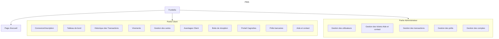

```mermaid
---
    title : PBS
---
flowchart TB
    site[Fundelia]
    welcome[Page d'accueil]
    subgraph clientPart[Partie Client]
    direction TB
        signin_singup[Connexion/Inscription]
        dashboard[Tableau de bord]
        transactionHistoric[Historique des Transactions]
        %% Relevés bancaires et création de factures
        transfers[Virements]
        %% Gestion bénéficiaires
        cardManagement[Gestion des cartes]
        %% Cartes éphémères
        advantages[Avantages Client]
        inBox[Boite de réception]
        %% Notification à chaque mouvement bancaire
        nestEgg[Portail Cagnottes]
        credit[Prêts bancaires]
        help[Aide et contact]
        %% Chatbot API Mistral
    end
    %% Possibilité d'ajouter une partie entreprise avec des gestions de paiement des employés, de levées de fonds, etc... -> partie entreprise des projets
    subgraph adminPart[Partie Administrateur]
    direction TB
        usersManagement[Gestion des utilisateurs]
        ticketsManagement[Gestion des tickets Aide et contact]
        transactionManagement[Gestion des transactions]
        creditManagement[Gestion des prêts]
        accountManagement[Gestion des comptes]
    end
    
    site --> welcome
    site --> clientPart
    site --> adminPart

```