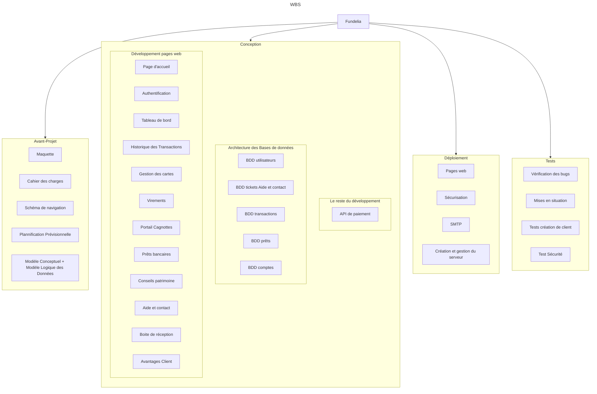

```mermaid
---
    title : WBS
---
flowchart TB
    site[Fundelia]
    subgraph Avant-Projet
        model[Maquette]
        specs[Cahier des charges]
        schem[Schéma de navigation]
        gantt[Plannification Prévisionnelle]
        mcd&mld[Modèle Conceptuel + Modèle Logique des Données]
    end
    subgraph Conception
        direction TB
        subgraph Le reste du développement
            api[API de paiement]
        end
        subgraph Architecture des Bases de données
            usersManagement[BDD utilisateurs]
            ticketsManagement[BDD tickets Aide et contact]
            transactionManagement[BDD transactions]
            creditManagement[BDD prêts]
            accountManagement[BDD comptes]
        end
        subgraph Développement pages web
            welcome[Page d'accueil]
            signin_singup[Authentification]
            dashboard[Tableau de bord]
            transactionHistoric[Historique des Transactions]
            cardManagement[Gestion des cartes]
            transfers[Virements]        
            nestEgg[Portail Cagnottes]
            credit[Prêts bancaires]
            propertyAdvices[Conseils patrimoine]
            help[Aide et contact]
            inBox[Boite de réception]
            advantages[Avantages Client]
        end
    end
    subgraph Déploiement
        M[Pages web]
        N[Sécurisation]
        O[SMTP]
        P[Création et gestion du serveur]
    end
    subgraph Tests
        Q[Vérification des bugs]
        R[Mises en situation]
        S[Tests création de client]
        T[Test Sécurité]
    end

    site --> Avant-Projet
    site --> Conception
    site --> Déploiement
    site --> Tests


```