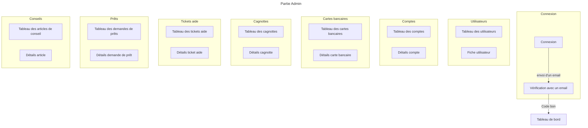

```mermaid
---
    title : Partie Client
---
flowchart TB
    %% Sign In & Sign Up
    welcome[Page d'accueil]
    subgraph SignIn/SignUp[Connexion/Inscription]
        signUp[Formulaire d'inscription]
        sendVerifSignUp[Vérification de l'email]
        creationClient[Création fiche client]
        signIn[Connexion]
        sendVerifSignIn[Vérification avec un email]
    end

    dashboard[Tableau de bord]
    return[Retour à la page d'accueil]
    
    %% Transfers Part
    subgraph transfers[Virements]
        transfersHistoric[Historique des virements]
        chooseAccount[Choisir depuis quel compte]
        beneficiaries[Répertoire des bénéficiaires et comptes]
        %% Beneficiaries
        addBeneficiary[Ajouter un bénéficiaire]
        addBeneficiaryConfirmation[Confirmation de l'ajout de bénéficiaire]
        %% New transfer
        makeTransfer[Formulaire de virement]
        transfertResume[Résumé du virement]
        transfertVerification[Vérification avec le code]
        transferConfirmation[Confirmation de virement]
    end

    %% Transactions Part
    subgraph transactions[Transactions]
        transactionsHistoric[Historique des transactions]
        bankStatements[Relevés bancaires]
        transactionDetails[Détails de la transaction]
    end

    %% Accounts and savings Part
    subgraph accounts&savings[Comptes et épargne]
        accountManagment[Gestion des comptes]
        createAccount[Catalogue des types de comptes]
        accountForm[Formulaire de création de compte]
        accountResume[Résumé des paramètres du compte]
        accountConfirmation[Confirmation de la création du compte]
        accountDetails[Détails du compte]
    end

    %% Loans Part
    subgraph loans[Prêts]
        loansManagment[Gestion des prêts]
        loansCatalog[Catalogue des types de prêts]
        loanForm[Formulaire de demande de prêt]
        loanResume[Résumé du formulaire rempli]
        loanDetails[Détails du prêt et de l'état dans lequel il est actuellement]
    end

    %% Kitty Part
    subgraph kittys[Cagnottes]
        kittyPortalManagment[Portail cagnottes]
        kittyForm[Formulaire de création de cagnottes]
        kittyResume[Résumé du formulaire rempli]
        kittyDetails[Détails de la cagnotte]
        addContributeurs[Répertoire de contacts]
        kittySettings[Paramètres de la cagnotte]
    end

    
    %% Settings
    subgraph settings[Paramètres]
    direction TB
        settingsPortal[Portail Paramètres]
        accountInformations[Informations du compte]
        code[Modification du code]
        password[Modifier le mot de passe]
        help[Aide et contact]
        ticketForm[Formulaire de ticket]
        ticketResume[Résumé du formulaire rempli]
        ticketDetails[Détails du ticket]
        documents[Documents fournis]
        confidentiality[Politique de confidentialité peut être ?]
        globalConditions[Conditions generales]
        closeAccount[Détails de la cloture de compte]
        closeVerification[Vérification avec mot de passe]
        closeConfirmation[Vérification avec code par mail]
        closeValidation[Validation de la cloture du compte]
        signOut[Déconnexion]
    end

    %% Client Advantages
    subgraph advantages[Avantages Client]
    direction TB
        advantagePortal[Portail Avantages Client]
        advantageCategories[Catégories d'avantages]
        advantageDetails[Détails de l'avantage]
    end

    %% Notifications
    subgraph notifications[Notifications]
    direction TB
        inbox[Boite de réception]
        otherPages[Autres parties]
    end

    %% Cards
    subgraph cards[Cartes]
    direction TB
        cardsHomepage[Page d'accueil Cartes]
        addCard[Formulaire de création de carte]
        linkTransfer[Lien vers la page de virement avec filtre de la carte seulement]
        cardDetails[Détails de la carte]
        cardResume[Résumé du formulaire]
        terminate[Confirmation de résiliation]
    end


    %% Links
        %% Sign
        welcome -- Bouton Connexion --> signIn
        welcome -- Bouton Inscription --> signUp
        signUp -- envoi d'un email --> sendVerifSignUp
        sendVerifSignUp -- Code bon --> creationClient
        creationClient -- Renvoie vers --> signIn
        signIn -- envoi d'un email --> sendVerifSignIn
        sendVerifSignIn -- Code bon --> dashboard
    
        %% Dashboard
        dashboard -- Bouton Virements --> transfersHistoric
        dashboard -- Bouton Historique des transactions --> transactionsHistoric
        dashboard -- Bouton Gestion des comptes --> accountManagment 
        dashboard -- Bouton Gestion des Prêts --> loansManagment
        dashboard -- Bouton Portail Cagnottes --> kittyPortalManagment
        dashboard -- Bouton Portail Avantages Client --> advantagePortal
        dashboard -- Bouton Boite de réception --> inbox
        dashboard -- Bouton Portail Paramètres --> settingsPortal
        dashboard -- Bouton Page d'accueil Cartes --> cardsHomepage
        
        %% Transfers
        transfersHistoric -- Faire un virement --> chooseAccount
        chooseAccount -- Compte séléctionné --> beneficiaries
        beneficiaries -- Ajouter un bénéficiaire --> addBeneficiary
        beneficiaries -- Cliquer sur un bénéficiaire --> makeTransfer
        makeTransfer -- Formulaire rempli --> transfertResume
        makeTransfer -- Vérification --> transfertVerification
        transfertVerification -- Validation --> transferConfirmation
        transferConfirmation -- Faire un nouveau virement --> transfersHistoric
        transferConfirmation -- Retour au Tableau de bord --> dashboard
        addBeneficiary -- Validation --> addBeneficiaryConfirmation
        addBeneficiaryConfirmation -- Faire un virement --> beneficiaries

        %% Transactions
        transactionsHistoric -- Voir les relevés bancaires --> bankStatements
        bankStatements -- Retour à l'historique des transactions --> transactionsHistoric
        transactionsHistoric -- Accéder aux détails d'une transaction --> transactionDetails
        bankStatements -- Retour au Tableau de bord --> dashboard

        %% Accounts & savings
        accountManagment -- Créer un compte --> createAccount
        createAccount -- Type de compte choisi --> accountForm
        accountForm -- Formulaire rempli --> accountResume
        accountResume -- Validation --> accountConfirmation
        accountConfirmation -- Accès au infos du compte --> accountDetails
        accountManagment -- Accès au infos du compte --> accountDetails
        accountConfirmation -- Retour à la gestion des comptes --> accountManagment
        accountDetails-- Retour à la gestion des comptes --> accountManagment
        accountConfirmation -- Retour au Tableau de bord --> dashboard

        %% Loans
        loansManagment -- Faire une demande de prêt --> loansCatalog
        loansCatalog -- Type de prêt choisi --> loanForm
        loanForm -- Formulaire rempli --> loanResume
        loanResume -- Validation --> loanDetails
        loansManagment -- Regarder un prêt --> loanDetails
        loanDetails -- Retour à la gestion des prêts --> loansManagment
        loanDetails -- Retour au Tableau de bord --> dashboard

        %% Kitty
        kittyPortalManagment -- Créer une cagnotte --> kittyForm
        kittyForm -- Formulaire rempli --> kittyResume
        kittyResume -- Validation --> kittyDetails
        kittyPortalManagment -- Regarder une cagnotte --> kittyDetails
        addContributeurs -- Retour aux détails --> kittyDetails
        kittyDetails -- Ajouter des participants --> addContributeurs
        kittyDetails -- Accéder aux paramètres --> kittySettings
        kittySettings -- Retour aux détails --> kittyDetails
        kittyDetails -- Retour à la gestion des cagnottes --> kittyPortalManagment
        kittyDetails -- Retour au Tableau de bord --> dashboard

        %% Client Advantages
        advantagePortal -- Afficher les catégories --> advantageCategories
        advantagePortal -- Cliquer sur un avantage --> advantageDetails
        advantageCategories -- Cliquer sur un avantage--> advantageDetails
        advantageDetails -- Retour sur la page d'accueil --> advantagePortal
          
        %% Notifications
        inbox -. Renvoie à la partie liée à la notification .-> otherPages 

        %% Settings
        settingsPortal -- Accéder aux informations --> accountInformations
        settingsPortal -- Modifier son code de vérification --> code
        settingsPortal -- Modifier le mot de passe de son compte --> password
        settingsPortal -- Ouvrir la gestion des tickets aide et contact --> help
        settingsPortal -- Accéder aux documents que l'on a pu fournir à la banque --> documents
        settingsPortal -- Accéder à l'article --> confidentiality
        settingsPortal -- Accéder à l'article --> globalConditions
        settingsPortal -- Cloturer son compte --> closeAccount
        settingsPortal -- Se déconnecter --> signOut
        accountInformations -- Validation modification des infos --> accountInformations
        code -- Validation modification du code --> code
        password -- Validation modification du mot de passe --> password
        help -- Créer un nouveau ticket --> ticketForm
        ticketForm -- Formulaire rempli --> ticketResume
        ticketResume -- Validation --> ticketDetails
        help -- Regarder un ticket --> ticketDetails
        ticketDetails -- Retour au portail Aide et contact --> help
        closeAccount -- Vérification --> closeVerification
        closeVerification -- Confirmation --> closeConfirmation
        closeConfirmation -- Validation cloturation compte --> closeValidation
        accountInformations --> settingsPortal
        code --> settingsPortal
        password --> settingsPortal
        help --> settingsPortal
        documents --> settingsPortal
        confidentiality --> settingsPortal
        globalConditions --> settingsPortal
        closeAccount --> settingsPortal
        signOut -- Retour à la page d'accueil --> return
        closeValidation -- Retour à la page d'accueil --> return
        return --> welcome

        %% Cards
        cardsHomepage -- Ajouter une nouvelle carte --> addCard
        addCard -- Formulaire rempli --> cardResume
        cardResume -- Redirection vers --> cardDetails
        cardsHomepage -- Cliquer sur les dépenses de la carte --> linkTransfer
        cardsHomepage -- Accéder aux détails d'une carte --> cardDetails
        cardDetails -- Résilier la carte --> terminate
        terminate -- Retour vers la page d'accueil des cartes --> cardsHomepage

```

```mermaid
---
    title : Partie Admin
---
flowchart TB
    subgraph signInadmin[Connexion]
        signIn[Connexion]
        sendVerifSignIn[Vérification avec un email]
    end

    dashboard[Tableau de bord]

    subgraph users[Utilisateurs]
        usersBoard[Tableau des utilisateurs]
        userDetails[Fiche utilisateur]
    end

    subgraph accounts[Comptes]
        accountsBoard[Tableau des comptes]
        accountDetails[Détails compte]
    end

    subgraph cards[Cartes bancaires]
        cardsBoard[Tableau des cartes bancaires]
        cardDetails[Détails carte bancaire]
    end

    subgraph kittys[Cagnottes]
        kittysBoard[Tableau des cagnottes]
        kittyDetails[Détails cagnotte]
    end

    subgraph help[Tickets aide]
        helpTicketsBoard[Tableau des tickets aide]
        helpTicketDetails[Détails ticket aide]
    end

    subgraph loans[Prêts]
        loanTicketsBoard[Tableau des demandes de prêts]
        loanTicketDetails[Détails demande de prêt]
    end

    subgraph advices[Conseils]
        articlesBoard[Tableau des articles de conseil]
        articleDetails[Détails article]
    end

    %% Client Advantages


    %% Links
        %% Sign In
        signIn -- envoi d'un email --> sendVerifSignIn
        sendVerifSignIn -- Code bon --> dashboard

```